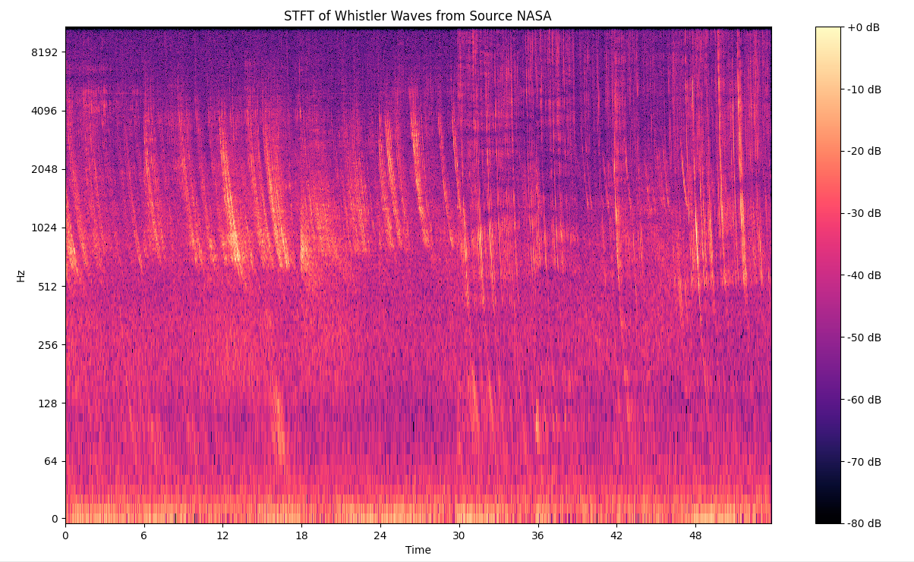
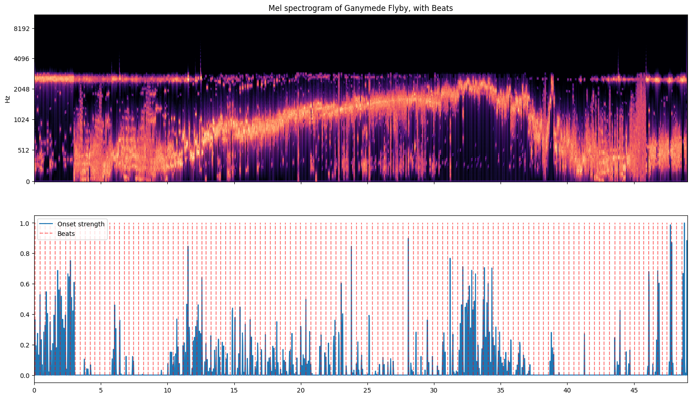
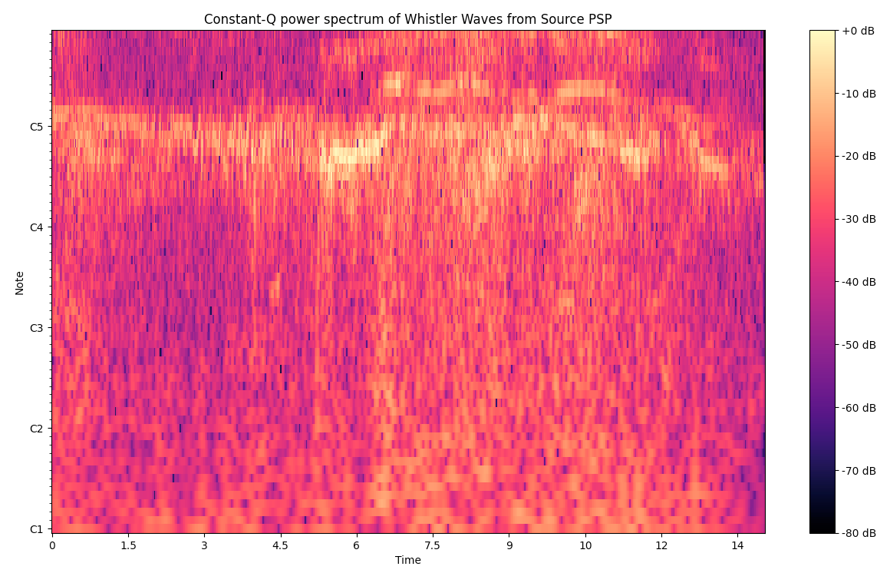
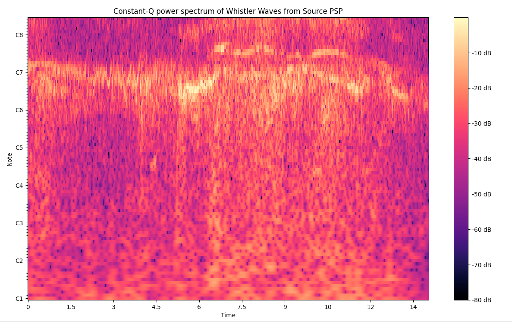

# Feature Engineering
Feature Engineering of Unstructured Data (Audio/.Wav)

Data for this project is stored in the DataWavs directory.
Data for the Sound .Wav files used in this project were gathered from the following sources:

**NASA**

Whistler Wave: https://www.nasa.gov/missions/mms/nasa-listens-in-as-electrons-whistle-while-they-work/

    - NASA Whistler .mp3
An example of the Short-Time Fourier Transform Spectogram of the Whistler Wave is shown below:

Kepler Star (Light Curve Waves) & Jupyter flyby's (Juno Mission): https://www.nasa.gov/audio-and-ringtones/ & https://soundcloud.com/nasa/audio-from-nasas-juno-mission-europa-flyby

    - Kepler Star KIC7671081B & KIC12268220C .mp3's
    - Ganymede flyby .Wav
    - Europa flyby .Wav
An example of the Mel-Spectograms with Beat Tracking created with the above data is shown below:

**John Hopkins University**

Whistler Wave: https://www.jhuapl.edu/news/news-releases/200114-parker-solar-probe-team-hears-first-whispers-solar-winds-birth

        - PSP Whistler Waves .mp3
An example of the CQT (Constant Q Transform) of the PSP Whistler Wave with a lower frequency resolution is shown below:

An example of the CQT (Constant Q Transform) of the PSP Whistler Wave with a higher frequency resolution is shown below:
